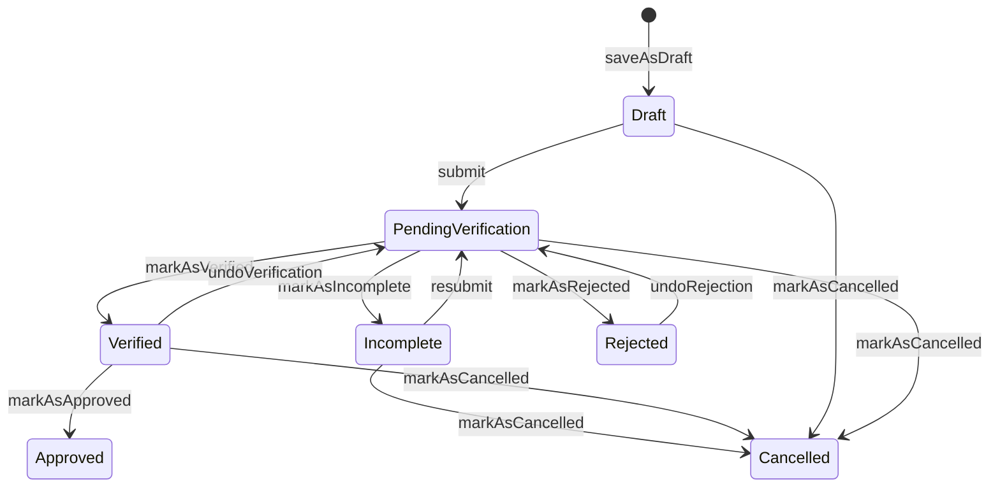

# The default workflow diagram

```mermaid
stateDiagram-v2
    classDef publicUserState fill:#0B6E4F,stroke:#0B6E4F,color:white
    
    [*] --> Draft: saveAsDraft
    Draft --> PendingVerification: submit
    PendingVerification --> Verified: markAsVerified
    PendingVerification --> Incomplete: markAsIncomplete
    Incomplete --> PendingVerification: resubmit
    Incomplete --> Cancelled: markAsCancelled
    Verified --> Approved: markAsApproved
    Verified --> PendingVerification: undoVerification
    Verified --> Cancelled: markAsCancelled
    PendingVerification --> Rejected: markAsRejected
    Rejected --> PendingVerification: undoRejection
    Draft --> Cancelled: markAsCancelled
    PendingVerification --> Cancelled: markAsCancelled
```
