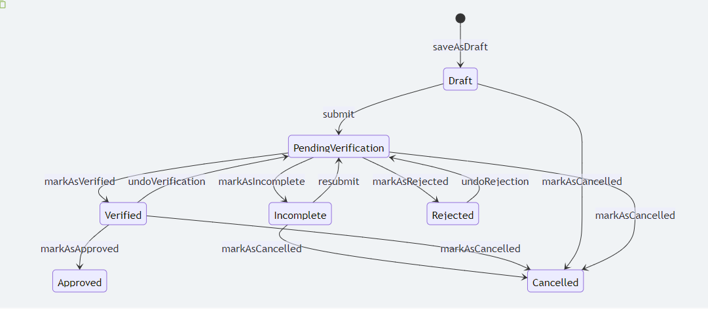

# The default workflow diagram




The statuses are represented in the boxes and the transitions are represented by the arrows. The actions are represented by the labels on the arrows. The diagram is a visual representation of the workflow that the application goes through in the system.

# Hooks
By default each and every transition has a before and after hook. List of default hooks are as follows:
- `doBeforeSubmitting`
- `doAfterSubmitting`
- `doBeforeMarkingAsIncomplete`
- `doAfterMarkingAsIncomplete`
- `doBeforeResubmitting`
- `doAfterResubmitting`
- `doBeforeMarkingAsVerified`
- `doAfterMarkingAsVerified`
- `doBeforeUndoVerification`
- `doAfterUndoVerification`
- `doBeforeMarkingAsRejected`
- `doAfterMarkingAsRejected`
- `doBeforeUndoRejection`
- `doAfterUndoRejection`
- `doBeforeMarkingAsCancelled`
- `doAfterMarkingAsCancelled`
- `doBeforeApproval`
- `doAfterApproval`

Each of these hooks will receive the application instance as an argument.
You may call any of the above hooks in your service class to perform any custom logic before or after the transition. For example you may want to create a member using the application details, after an application has been approved. You can do this by calling the `doAfterApproval` hook in your service class.

```php
    public function doAfterApproval(Application $application): void
    {
        if (filled($application->generated_type)) { // The application has already been processed
            return;
        }

        $member_name = $application->getFormInputValueForField('member_name');
        $member_email = $application->getFormInputValueForField('member_email');

        $member = new \App\Models\Member();
        $member->name = $member_name;
        $member->email = $member_email;
        $member->save();

        $application->generated()->associate($member); // Associate the generated member with the application
        $application->save();
    }
```
